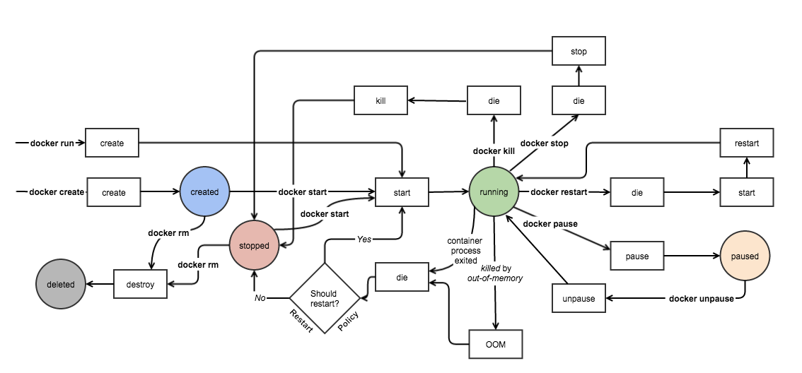

## docker workflow

1. 도커 이미지 빌드
2. 도커 레지스트리에 공유
3. 도커 이미지 실행

애플리케이션을 실행 가능한 상태로 만든 후(이미지 빌드) 레지스트리에 공유하면, 레지스트리를 통해 이미지를 다운받아 바로 실행할 수 있음

도커를 구성하고 있는 요소들은 다음과 같음

## docker lifecycl (event state)

[출처](https://docker-saigon.github.io/post/Docker-Internals/#overview-of-container-runtimes:cb6baf67dddd3a71c07abfd705dc7d4b)

생성(created) -> 실행(start) -> 일시 정지(pause)/재개(unpause) -> 정지(stop) -> 재시작(restart) 또는 삭제(remove)

**created**
- 이미지로부터 컨테이너가 생성된 상태
- 파일 시스템이 설정되고, 네트워크와 볼륨이 준비됐지만 애플리케이션 실행이 되지 않은 상태
- `docker create`

**running**
- 생성된 컨테이너를 실행하여 애플리케이션을 시작한 상태
- 이 때 컨테이너 내부에서 정의된 프로세스가 시작됨
- `docker start`: 생성된 컨테이너 실행
- `docker run`: 생성과 실행을 동시에 수행

**paused**
- 실행 중인 컨테이너의 모든 프로세스를 일시적으로 멈춘 상태, 다시 시작될 때까지 정지 상태가 유지됨
- CPU 사용을 중지하지만, 메모리와 상태는 그대로 유지됨
- `docker pause`

**running (unpause)**
- 일시 정지된 컨테이너의 프로세스를 다시 재개한 상태
- `docker unpause`

**exited (stop)**
- 실행 중인 컨테이너를 종료한 상태
- 컨테이너는 운영체제의 `SIGTERM` 신호를 받아 정상적으로 종료됨
- 프로세스가 종료되고, 컨테이너는 멈추지만 삭제되지 않고 호스트 디스크에 남아 있음
- `docker stop`

**exited (kill)**
- 컨테이너를 즉시 강제 종료한 상태
- 정상 종료 신호 상태가 아닌 `SIGKILL` 신호가 전송되어 프로세스가 즉시 종료됨
- `docker kill`

**running (restart)**
- 종료된 컨테이너를 다시 시작한 상태
- docker stop 후 다시 시작할 때 유용함
- `docker restart`